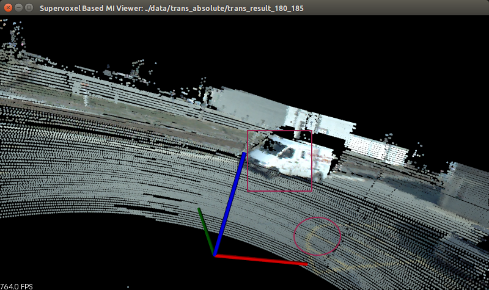

# Clustering based Scan-Registration for fused sensor data

## Problem Statement
  The goal of 3-D scan registration is to estimate the optimal transformation between two scans.  Let two scans  A = {a1,.......,an}and B = {b1,....bm}represent two point clouds recorded by a sensor (eg.- Velodyne Lidar HDL-64E), and the set of 3-D rigid body transformations by SE(3) . In this implementation transformation T  represented by SE(3) is defined by parameter pose represented as [tx, ty, tz, roll, pitch, yaw].  A scan point x transformed by T can be represented as T(p, x) given by:
  T(p, x) = R(yaw)R(pitch)R(roll) x + t
  Where R(theta) is 3x3 Rotation matrix along an axis (x, y, z) by an angle theta (roll, pitch, yaw), and tis 3x1 translation vector.
  Aim of the scan registration algorithm is to find the correct transformation that aligns the two given scans. 

This algo aligns the two scans using Normal distribution Transform after clustering the model scan. Currently the algorithm works accurately for scans that are 2-3 meters apart. For scans spaced further apart the Quasi Newton method (bfgs) converges too early. Optimization will be modified to Newton, which will be more robust and faster due to analytic implementation of second order derivative of the cost function. 
  
  I am also working on the CUDA implementation of this. GPU implementation will allow faster comutation of normal and covariance, making the algo ultra fast. Result on two scan is shown below.

  
  
 Top View of the clustered point cloud
  
  Clustering implementation is originally taken from pcl. The code has been modified to allow the access adjacency octree structure. Also a function has been created to return the labeled map of the leaves in the octree with their corresponding mapping to the supervoxel. Functionality to allow to octrees with similar dimensions is also added.
  
  

Raw scans from Velodyne HDL-64E

Aligned scans

